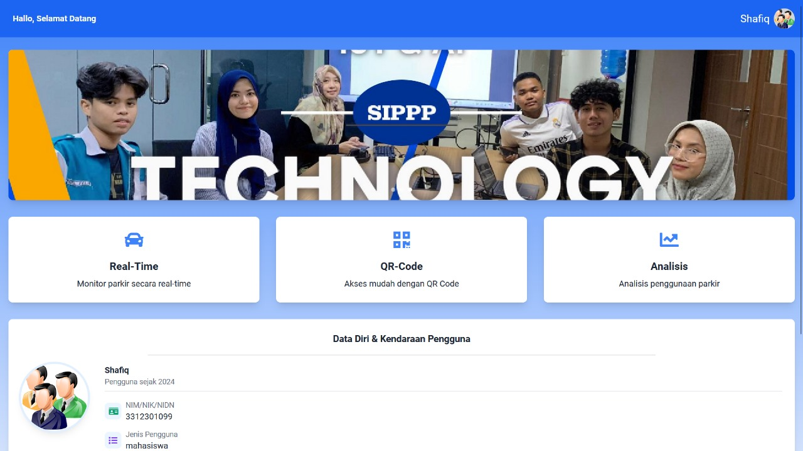

# SIPPP | Data driven smart parking system powered by IoT and Big Data Analytics

## Description

Parkwell" adalah sistem parkir pintar berbasis website yang menggunakan teknologi IoT. Sistem ini memanfaatkan data secara real-time untuk memberikan solusi parkir yang lebih cerdas, mengurangi waktu yang diperlukan untuk mencari tempat parkir. Sistem ini dirancang untuk parkir off-street baik bagi motor dan mobil, sehingga memungkinkan pengaturan parkir yang lebih terstruktur. 
   

---

## Teams
Project Manager:  
Miratul Khusna Mufida, S.ST, M.Sc 

Leader:  
3312311122– Zidan Muhammad Ikvan

Member:  
3312301097– Muhammad Adib Fakhri Siregar  
3312301083– Yoel Feliks Hutabarat  
3312301025 – Nayla Nabillah Arishima  
3312301046 – Meizua Muhsana

---
